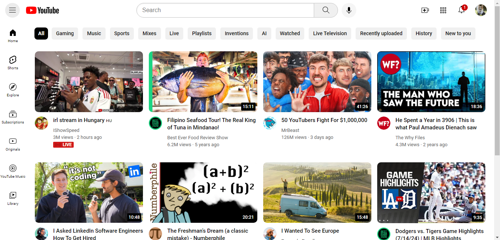

# YouTube UI Clone

This project was developed for training purposes to practice front-end development and layout construction. It is a visual clone of the YouTube homepage built with HTML and CSS.

## Overview

- **Responsive Design:** The layout adapts smoothly to different screen sizes.
- **Well-Structured:** The project folder is organized cleanly (separating styles, icons, and assets) for easy maintainability.

## Preview

